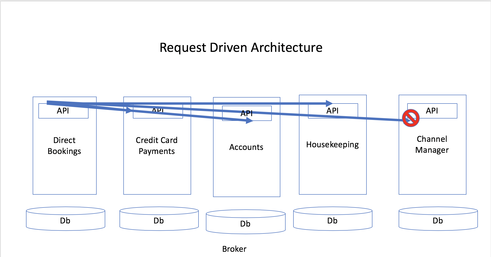
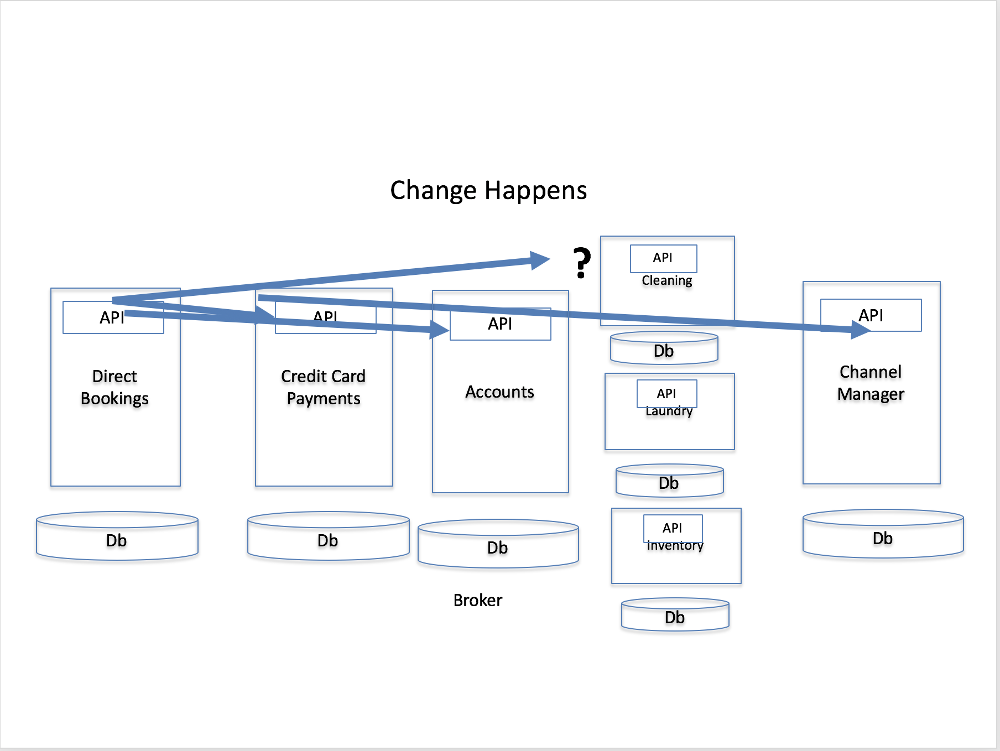
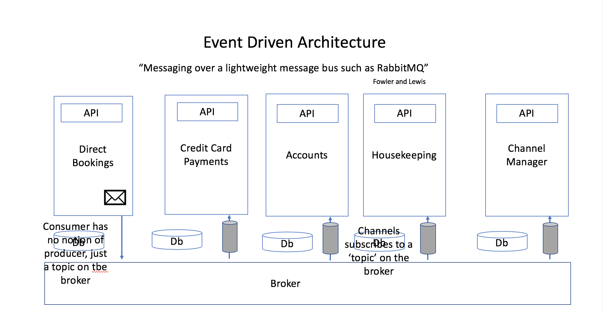
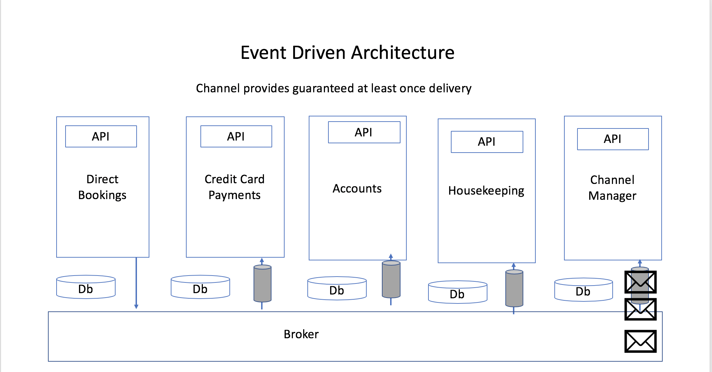

# Event Driven Collaboration

## Messaging

Messages are packets of data, sent asynchronously over middleware

-   Commands, Documents, and Events are types of messages.
-   Commands expect another service to handle the request, and possibly to respond.
-   Documents represent the transfer of data; a query is a command, with a document response.
-   Events are a notification that something happened.

Commands can use a point-to-point channel i.e. only the sender and receiver are aware of the channel. Events can either use a publish-subscribe channel, or raise the event via a router that manages
dynamic subscriptions. The significant difference is that a sender of a command knows who the receiver is, the raiser of an event does not.

## Temporal Coupling

Why is it important that this integration is asynchronous? The answer is that we want to avoid Temporal Coupling.

When we move from a monolithic to a microservices architecture, functionality and data becomes distributed across multiple microservices. In order to satisfy a given use case of our software, we
may need to multiple microservices to collaborate.

Temporal Coupling occurs when in order to satisfy this use case, a set of microservices must all be available at the same time.

Commonly, this occurs in systems that use synchronous communication protocols to integrate, such as HTTP + JSON, or gRPC. We refer to this as a Request Driven Architecture (or perhaps even Request Driven Collaboration).

Let\'s take an example. In the illustration below we imagine hotel software and the use case of booking a room at the hotel.

When a booking is made by an actor, an HTTP POST is made to our Direct Booking microservice with the details in the body of the request. The Direct Booking microservice validates the supplied details, and then
validates the request for missing information, room availability and so on.

Once the booking is made the workflow for the operation suggests that we need to take a payment. In this use case the payment is being made by an existing account holder, and so the POST body does not contain the
payment details, instead, details already held on account are being used.

In addition to taking a payment, we want to inform housekeeping of the booking, and use our Channel Manager to lower the availability of rooms on aggregator sites.

How does the Direct Booking microservice communicate these steps to other microservices?

In a Request Driven Architecture we would use a synchronous protocol such as HTTP+JSON or gRPC to call the API exposed by the other microservices. The issue here is that for our service to work, all these other services must also be available.

A useful metaphor here is a phone call. If we make a phone call, the other party must be available i.e. present and not busy with another call.

If the Channel Manager is not available, as in the diagram, does our transaction, the room booking, fail.

Now, we can try to mitigate the risks of a Request Driven Architecture. We can call through a proxy that load balances across a pool of upstream instances of the service. The proxy can retry failed requests to
alleviate transient availability issues and take bad instances out of the pool.

This is what a \'service mesh\' does - it improves the availability of a Request Driven Architecture by seeking to lower Temporal Coupling.

## Behavioral Coupling

Why does it matter whether we know about the receiver (a command) or are ignorant as to receivers? The answer is behavioral coupling.

Let\'s look at our hotel example again.

What happens if we decide that we no longer want a single housekeeping service, but a set of services such a laundry, room cleaning etc.? In a Request Driven Architecture the caller knows about the sequence of  steps to complete a booking. This means that any change to the sequence, to call the new Room Cleaning microservice instead of the housekeeping service requires a change to Direct Booking.

This coupling, through knowledge of other services, if a form of behavioral coupling. It hampers our goal of independent deployability because downstream components are impacted by changes to the partitions of upstream components, or to the shape of their APIs.

## Event Driven Collaboration

Event Driven Collaboration helps us solve the problems of temporal and behavioural coupling.

When we publish an event, a subscriber uses a queue to receive events asynchronously. Because messages are held in a queue, the subscriber does not have to be available when the publisher produces the message,
only the queue does. If the subscriber is not available, the queue holds the message until the subcriber can process it.

This removes temporal coupling - we do not need both services to be available at the same time.

Let\'s look at the hotel example again. When the direct booking is made, the Payments microservice the Housekeeping service and the Channel Manager service can be unavailable. Their subscription just queues the
message until the service is available.

This allows us to take the booking, even if these services are not  available - we have given our microservices \'bulkheads\' against failure. Our system can keep offering service, even if parts of it are
not available.

We do have to design our workflow, such that the customer expects an asynchronous operation i.e. \"We will mail you to confirm your booking\". This may seem like a limitation, but many workflows were
traditionally asynchronous before widespread automation, so processes exist for this approach, and customers expect \'tasks\', such as making a booking may need confirmation.

If the metaphor for Request Driven Architectures is a phone call, for Event Drive Architectures it is SMS or a messaging app such as WhatsApp or Slack (or even a phone answering service). You don\'t need both
parties to be available, when you use messaging.

In addition, a publisher does not know who it\'s subscribers are. That is the function of message oriented middleware - a broker. The broker routes messages from a publisher to subscribers. Because of this,
changes to the subscribers don\'t impact the publisher. The publisher remains independently deployable of its subscribers.

So an Event Driven Architecture benefits from a lack of behavioral coupling too.

(Note that if we use commands, and not events, between microservices i.e. the sender knows who should receive this instruction, we do not have temporal coupling, but we do have behavioral coupling).

## Next

See [Event Carried State Transfer](EventCarriedStateTransfer.html) for guidance on how to \'join\' data between two microservices, when you need data from more than one service to carry out an operation.
