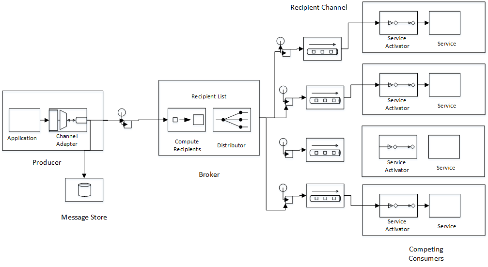

# Using an External Bus 

Brighter provides support for an External Bus. Instead of handling a command or event, synchronously and in-process, (an Internal Event Bus) work can be dispatched to a distributed queue to be handled
asynchronously and out-of-process. The trade-off here is between the cost of distribution (see [The Fallacies of Distributed Computing](https://en.wikipedia.org/wiki/Fallacies_of_distributed_computing).

An External Bus allows you offload work to another process, to be handled asynchronously (once you push the work onto the queue, you don\'t wait) and in parallel (you can use other cores to process the
work). It also allows you to ensure delivery of the message, eventually (the queue will hold the work until a consumer is available to read it).

As part of the [Microservices](https://martinfowler.com/articles/microservices.html) architectural style an External Bus let's you implement an [Event Driven Architecture](/contents/EventDrivenCollaboration.md).

In addition use of an External Bus allows you to throttle requests - you can hand work off from the web server to a queue that only needs to consume at the rate you have resources to support. This
allows you to scale to meet unexpected demand, at the price of [eventual consistency.](https://en.wikipedia.org/wiki/Eventual_consistency). See the [Task Queue Pattern](/contents/TaskQueuePattern.md)

## Brighter\'s External Bus Architecture

Brighter implements an External Bus using a [Message Broker](http://www.enterpriseintegrationpatterns.com/MessageBroker.html). The software that provides the Message Broker is referred to as Message-Oriented Middleware (MoM). Brighter calls its abstraction over MoM a *Transport*.

The producer sends a **Command** or **Event** to a [Message Broker](http://www.enterpriseintegrationpatterns.com/MessageBroker.html) using **CommandProcessor.Post()** or **CommandProcessor.DepositPost** and **CommandProcessor.ClearOutBox** (or their \*Async equivalents).

We use an **IAmAMessageMapper** to map the **Command** or **Event** to a **Message**. (Usually we just serialize the object to JSON and add to the **MessageBody**), but if you want to use higher performance
serialization approaches, such as [protobuf-net](https://github.com/mgravell/protobuf-net), the message mapper is agnostic to the way the body is formatted.)

When we deserialize we set the **MessageHeader** which includes a topic (often we use a namespaced name for the **Command** or **Event**).

We store the created **Message** in a [Outbox](https://microservices.io/patterns/data/transactional-outbox.html) for use by **CommandProcessor.ClearOutbox()** if we need to resend a failed message.

The Message Broker manages a [Recipient List](http://www.enterpriseintegrationpatterns.com/RecipientList.html) of subscribers to a topic. When it receives a **Message** the Broker looks at the topic (in Brighter terms the *Routing Key*) in the **MessageHeader** and dispatches the **Message** to the [Recipient Channels](http://www.enterpriseintegrationpatterns.com/MessageChannel.html) identified by the Recipient List.

The consumer registers a [Recipient Channel](http://www.enterpriseintegrationpatterns.com/MessageChannel.html) to receive messages on a given topic. In other words when the consumer\'s registered topic matches the producer\'s topic, the broker dispatches the message to the consumer when it receives it from the producer.

A **Message** may be delivered to multiple Consumers, all of whom get their own copy.

in addition, we can support a [Competing Consumers](http://www.enterpriseintegrationpatterns.com/CompetingConsumers.html) approach by having multiple consumers read from the same [Channel](http://www.enterpriseintegrationpatterns.com/MessageChannel.html) to allow us to scale out to meet load.




## Sending via the External Bus

Instead of using **CommandProcessor.Send()** you use **CommandProcessor.Post()** or **CommandProcessor.DepositPost** and **CommandProcessor.ClearOutbox** to send the message

``` csharp
var reminderCommand = new TaskReminderCommand(
     taskName: reminder.TaskName,
     dueDate: DateTime.Parse(reminder.DueDate),
     recipient: reminder.Recipient,
     copyTo: reminder.CopyTo);

 _commandProcessor.Post(reminderCommand);
```

You add a message mapper to tell Brighter how to serialize the message for sending to your consumers.

``` csharp
public class TaskReminderCommandMessageMapper : IAmAMessageMapper<TaskReminderCommand>
{
    public Message MapToMessage(TaskReminderCommand request)
    {
        var header = new MessageHeader(messageId: request.Id, topic: "Task.Reminder", messageType: MessageType.MT_COMMAND);
        var body = new MessageBody(JsonConvert.SerializeObject(request));
        var message = new Message(header, body);
        return message;
    }

    public TaskReminderCommand MapToRequest(Message message)
    {
        return JsonConvert.DeserializeObject<TaskReminderCommand>(message.Body.Value);
    }
}
```
## Receiving via the External Bus 

A consumer reads the **Message** using the [Service Activator](http://www.enterpriseintegrationpatterns.com/MessagingAdapter.html) pattern to map between an [Event Driven Consumer](http://www.enterpriseintegrationpatterns.com/EventDrivenConsumer.html) and a Handler.

The use of the Service Activator pattern means the complexity of the distributed task queue is hidden from you. You just write a handler as  normal, but call it via post and create a message mapper, the result is
that your command is handled reliably, asynchronously, and in parallel with little cognitive overhead. It just works!

``` csharp
public class MailTaskReminderHandler : RequestHandler<TaskReminderCommand>
{
    private readonly IAmAMailGateway _mailGateway;

    public MailTaskReminderHandler(IAmAMailGateway mailGateway, IAmACommandProcessor commandProcessor)
        : this(mailGateway, commandProcessor, LogProvider.GetCurrentClassLogger())
        {}

    public MailTaskReminderHandler(IAmAMailGateway mailGateway, ILog logger) : base(logger)
    {
        _mailGateway = mailGateway;
    }

    [RequestLogging(step: 1, timing: HandlerTiming.Before)]
    [UsePolicy(new [] {CommandProcessor.CIRCUITBREAKER, CommandProcessor.RETRYPOLICY}, step: 2)]
    public override TaskReminderCommand Handle(TaskReminderCommand command)
    {
        _mailGateway.Send(new TaskReminder(
        taskName: new TaskName(command.TaskName),
        dueDate: command.DueDate,
        reminderTo: new EmailAddress(command.Recipient),
        copyReminderTo: new EmailAddress(command.CopyTo)
        ));

        return base.Handle(command);
    }
}
```