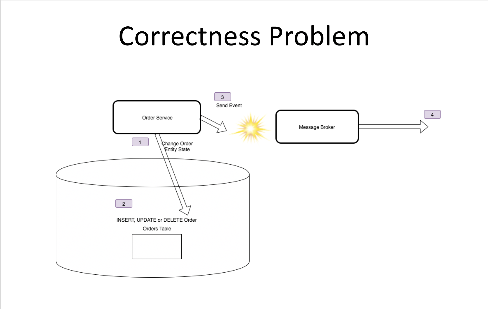
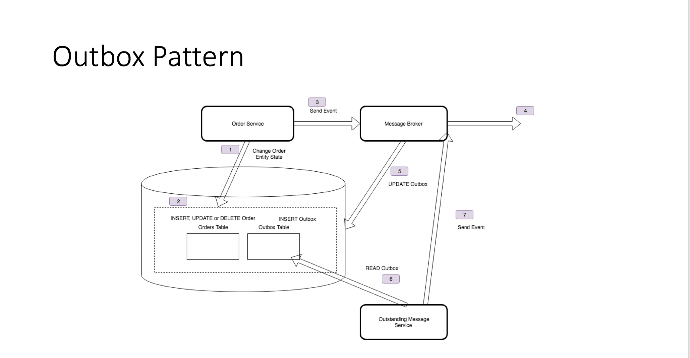

# Outbox Pattern Support

## Producer Correctness

When a microservice changes the state for which it is the system of record, and then signals to subscribers via an event that it has changed its state, how do we ensure that subscribers receive the event and are
therefore consistent with the producer?

The system of record may become inconsistent with downstream consumers because after writing changes to an entity, we may fail to publish the corresponding message. Our connection to the message-oriented middleware (MoM) may fail, or MoM may fail.

The new record is saved to the backing store, but the event is not raised so subscribing systems become inconsistent. We have a lost send.

Distributed Transactions may seem like an answer, but possess two issues. First, we are probably using a backing store and message-oriented middleware from different vendors or OSS projects that don\'t support the same distributed transaction protocol. Second, distributed transactions don\'t scale well.

We might naively try to fix this by sending the message first, then updating the backing store if that succeeds. But this won\'t necessarily work either, as we might fail to write to the database.

The new record is posted to downstream systems, but the local database call is rejected, and so the upstream system is now inconsistent. A phantom send.

In either solution we might simply decide that the best option is to ensure that we can retry what is hopefully a transient error. This may solve the problem in many instances, and is a good first step. But an
endless retry loop has its own dangers, consuming resources and reducing throughput, and if the app crashes we will still only be partially complete. So it cannot guarantee delivery of the message that matches
the write.

## The Outbox Pattern

In the Outbox pattern, we use the ACID properties of an RDBMS. We write not only to the table that stores the entity that we are inserting, updating, or deleting, but also we write the message we intend to send
to an \'outbox table\' in the same Db.

We mark the time that the message was written, as part of the transaction, on the record.

Then when we send the message via the Broker, we mark the message as dispatched in the table.

An out-of-band sweeper process can then run, and query for messages that have not been sent within a time window (their written date is over a threshold of milliseconds ago, and they have no dispatched time stamp).
It then resends those messages. If it sends them, it marks them as dispatched. As the sweeper process keeps polling for messages that have not yet been sent, we will eventually send all the messages. So we have
**guaranteed delivery** but eventual consistency.

It is possible that the write to the row to update the dispatched status will fail. It is not in a transaction between broker and RDBMS either. If that happens, we may send the message twice.

For this reason, the Outbox pattern offers us **guaranteed, at least once** delivery. Consumers must be prepared for this. Either they can use an Inbox, which records all the messages they have seen recently and
discards duplicates, or they must be idempotent and the result of processing the message twice has no side-affects.

See [Brighter Outbox Support](BrighterOutboxSupport.html) for more on how to ensure Producer-Consumer correctness in Brighter.
