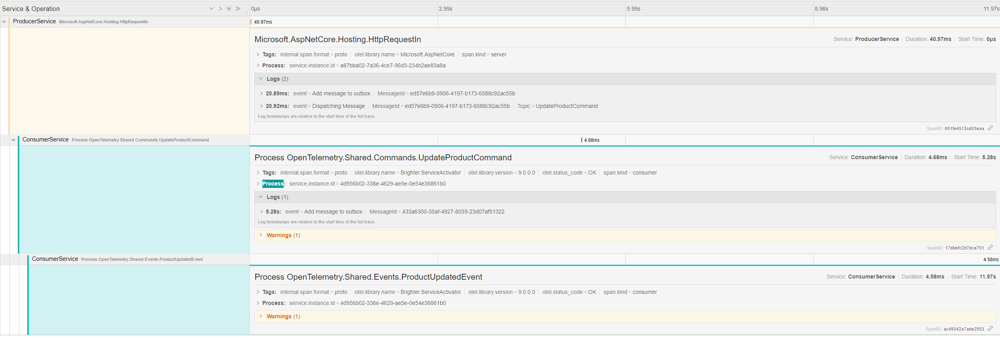

# Telemetry

Starting in version 9.2.1 Brighter now supports Open Telemetry Tracing

## Configuring Open Telemetry

The OpenTelemetry SDK can be configured to listen to Activities inside of Brighter for more information [OpenTelemetry Tracing](https://opentelemetry.io/docs/instrumentation/net/getting-started/)


The below code will 
* Enable OpenTelemetry tracing
* Set the service name to "ProducerService"
* Set OpenTelemetry traving to listen to all Brighter and Microsoft sources
* Export the telemetry tracts to Jaeger

```csharp
//The name of the service
const myServiceName = "ProducerService"

var jaegerEndpoint = new Uri("http://localhost:9411/api/v2/spans");

using var tracerProvider = 
    Sdk.CreateTracerProviderBuilder()
    .SetResourceBuilder(ResourceBuilder.CreateDefault().AddService(myServiceName))
    .AddSource("Paramore.*", "Microsoft.*")
    .AddJaegerExporter(o =>
    {
        o.Endpoint = jaegerEndpoint;
    })
    .Build();
```

## Activity Sources

The activity sources that Brighter emits from are:
  * Paramore.Brighter - Traces started in the **Command Processor** will be given this (Including **Outbox Sweeper**)
  * Paramore.Brighter.ServiceActivator - Traces Started in the **Service Activator**

Please note that Brighter will honor existing spans, i.e. When using ASPNet a Request will start a trace, it is for this reason that the sample above also includes "Microsft.*" as Bighter will participate in an active trace.


This distributed traces shows a message that is produced from an ASP.Net request and the consumed by Service Activator

## Reported Events

At this time Brighter records the following events

| Event                                      | Description |
| ------------------------------------------ | ----------- |
| Add message to outbox                      | When a message is added to the outbox |
| Get outstanding messages from the outbox   | During an implicit clear when retrieving undispatched messages from the outbox |
| Dispatching message | When a message is being dispatched to a message transport |
| Bulk dispatching messages | When a batch of messages are being dispathced to a message transport |
