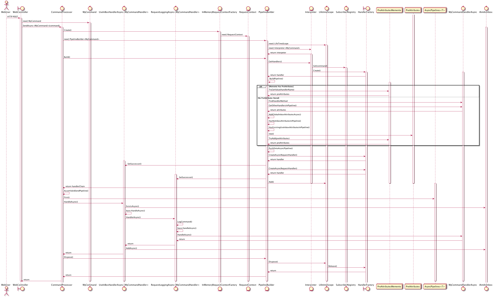

# How The Command Processor Works

You don\'t need to understand how Brighter works under the hood to use
it, but if you want to debug, or contribute to the project, it can help
to know what is going on.

## The Dispatcher

Ignoring attributes, which create a pipeline, for now, all of
CommandProcessor\'s dispatch methods:

-   Accept a IAmARequest derived class as an argument
-   Find the registered handler(s) for the type of the command
-   Ask the factory you provide to create an instance of that handler
-   Call Handle() or HandleAsync() as appropriate on that handler,
    passing in the command

Let\'s look at that sequence in more detail, for those of you who want
to understand the detail, so that you can walk the code if required.
We\'ll show the code looking for a SendAsync() but the Send() works the
same way. Publish() and PublishAsync() are a minor variation in that
they may dispatch to multiple handler chains, not just the one.

Let\'s model what happens, if you use Brighter as the Ports layer behind
the an ASP.NET Core web controller.

1: The client makes an HTTP POST request to ASP.NET Core which marshalls
the parameters and calls your web controller\'s POST method.

2: The web controller takes those parameters, along with any other
relevant information, such as identity from the bearer token, and
creates a Command. Let\'s call it MyCommand

3: The web controller calls the SendAsync() method on CommandProcessor
because it is a Command and we expect one handler. If this was an Event,
perhaps raised by the command handler itself, we would call
PublishAsync() instead.

4: The SendAsync() method creates a RequestContext, using the supplied
RequestContextFactory. Here we use the supplied
InMemoryRequestContextFactory, which does not try to persist the state
of the request, and is adequate for most purposes.

5: The CommandProcessor then creates a new PipelineBuilder. The
PipelineBuilder is a generic type specialized to the type of the
Request. (Both Command and Event inherit from Request.) The
PipelineBuilder orchestrates building the chain of responsibility that
will handle our request.

6: The PipelineBuilder creates an Interpreter. Again this is a generic
type, specialized to the type of the Request. The interpreter is going
to find the \'target handlers\'. A \'target handler\' is your code that
implements IAmARequestHandlerAsync (usually via RequestHandlerAsync\<\>)
that you register via the SubscriberRegistry. it is where the code which
exercises the entities of your domain should live. The PipelineBuilder
also creates a LifeTimeScope It will track the handlers we have created
as part of this request.

7: The CommandProcessor calls Build() on the PipelineBuilder to create
the pipeline.

8: The PipelineBuilder asks the Interpreter for an instance of the
registered RequestHandlerAsync\<\>.

9: The Interpreter uses the SubscriberRegistry to lookup the
RequestHandlerAsync\<\> that we have associated with this Command. We
don\'t show it here, but we passed the SubscriberRegistry to the
CommandProcessor when we built it, so it\'s not created here. The
SubscriberRegistry returns the type of RequestHandlerAsync\<\>. In our
example MyCommandHandlerAsync.

10: The Interpreter now tries to build an instance of the handler by
calling the HandlerFactory. The HandlerFactory is supplied to the
CommandProcessor when it is built. It is user implemented because we
don\'t know how to build your handler, which has its dependencies in
your code. However, we do integrate with ServiceCollection if desired.
In our case we build a MyHandlerAsync.

11: Having constructed a handler, we now need to build the pipeline
based on the attributes that you have decorated the handler with (and
any global attributes). We call the BuildPipeline method to create the
pipeline.

12: We start with the part of the chain called before the registered
handler - attributes flagged HandlerTiming.Before.

13: Because your pipeline\'s configuration can only change at design
time (when you write code) and not at runtime (when you execute) we only
want to figure out the attributes of the chain once. So we store the
attribute list, once it\'s been determined, in a memento collection.
This collection is a static. The first thing we do when building is see
if we have already determined the configuration. If we have, we will use
that.

14: If we have not got a pipeline configuration, then we need to build
one. Our first step is to call FindHandlerMethod() to get the handler
method from our target handler i.e. MyCommandHandler in this case.
RequestHandlerAsync does the heavy lifting for you here.

15: We then use RTTI to find the attributes you have tagged your handler
method with. In this case, let\'s pretend we just have
RequestLoggingAsync\<\>. We order them via the Step value on the
attribute (note that step collision order behavior is undefined).

16: Once we have the per-handler list of attributes, we check if the
CommandProcessor has been configured to use a global inbox. If it
already has a UseInboxAsync attribute, or has a NoGlobalInbox attribute
in the preAttributes list, we are done. Otherwise, if we have set up a
global inbox, we add UseInboxAsync into the list of handlers.

17: We then add the preAttributes into the collection of preAttributes,
so that we will not need to use RTTI to build them again. Let\'s assume
that we have configured out CommandProcessor with a global inbox.

18: Next we have to construct this preAttribute chain. We iterate over
all of the attributes and create the handlers by calling the supplied
HandlerFactory. Again, this is because only your code knows how to
create your handlers. If you use our support for ServiceCollection, then
we will search the assemblies in the project for classes that implement
IAmARequestHandlerAsync (including those we supply) and register them
for you. The hander we create is determined from the type information
supplied by the Attribute. In our example we will construct a
RequestLoggingHandlerAsync and a UseInboxHandlerAsync.

19: We construct the pre-Attributes. once we have constructed a Handler,
we set it\'s successor property to be the next handler in the chain.

20: We then repeat this process for any post handler attributes i.e.
those tagged as HandlerTiming.After. We don\'t have any of those here,
so we don\'t show that again this time. This decision was mainly for
simplicity.

21: We then add the handlers to the LifeTimeScope of the pipeline.

22: We then return the handler chain that we just constructed to the
CommandProcessor.

23: The CommandProcessor checks that we have a valid pipeline; for a
SendAsync we expect exactly one pipeline will handle the Command. For
PublishAsync we allow zero or more.

24: Now we call the pipeline by passing our MyCommand to the first
handler in the chain, in our case the UseInboxHandlerAsync.

25: The UseInboxHanlderAsync has an inbox as a private member, that was
passed in via the constructor via the HandlerFactoryAsync. This is a
data store specific implementation of IAmAnInbox. if the OnceOnly
parameter is set on the attribute then we call the Inbox\'s ExistsAsync
method to determine if we have already processed the command. If the
command has not already been processed, we call the base class\'s
HandleAsync method.

26: The base class\'s HandleAsync() method we use the successor field
(see 19 above) to determine the next handler in the chain and we call
it\'s HandleAsync() method. In this case we call
RequestLoggingAsync\<\>\'s HandleAsync method.

27: The RequestLoggingAsync\<\>\'s HandleAsync method logs the call, and
again calls the base class\'s HandleAsync() method to pass the call down
the pipeline.

28: Finally, we call MyCommandHandlerAsync whose HandleAsync() command
runs our business logic. Again we call the base class\'s HandleAsync()
method, but as there is no successor we return.

29: We return from RequestLoggingAsync\<\> which has no work left to do.

30: UseInboxHandlerAsync calls IAmAnIbox\'s AddAsync method to write the
command to the Inbox. Then it returns.

31: SendAsync returns, and we are done.
