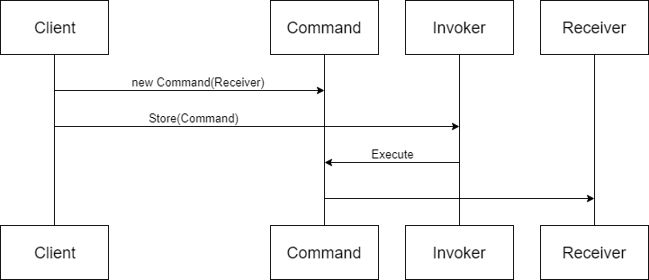
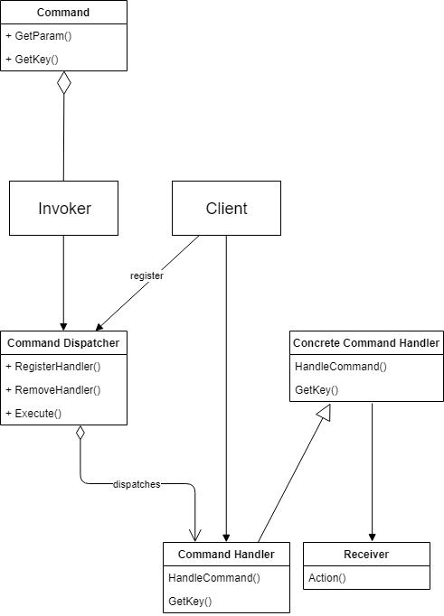
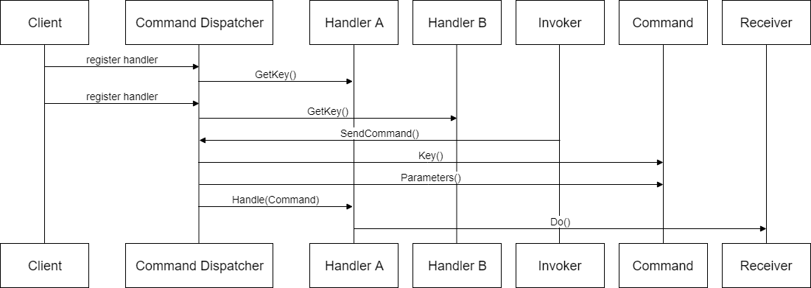
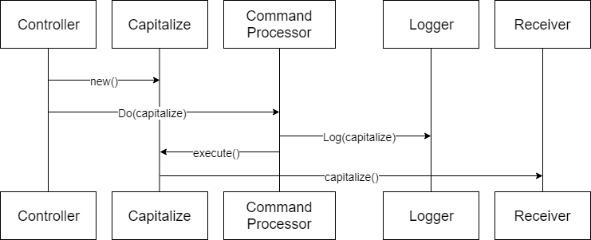

# Command Patterns

## Command

The **Command** design pattern encapsulates a request as an object, allowing reuse, queuing or logging of requests, or undoable operations. It also serves to decouple the implementation of the request from the
requestor. The caller of a Command object does not need to understand how the Command is implemented, only that the Command exists. When the caller and the implementer are decoupled it becomes easy to replace or
refactor the implementation of the request, without impacting the caller - our system is more modifiable. Our ability to test the Command in isolation of the caller - allows us to implement the ports and
adapters model easily - we can instantiate the Command, provide \'fake\' parameters to it and confirm the results. We can also use the command from multiple callers, although this is not a differentiator from the
service class approach.

**Command** - Declares an interface for executing an operation.

**ConcreteCommand** --Defines a binding between a Receiver object and an action. Implements Execute by invoking the corresponding operation(s) on the Receiver.

**Client** -- creates a ConcreteCommand object and sets its receiver.

**Invoker** - asks the command to carry out the request.

An **Invoker** object knows about the **Concrete Command** object. The Invoker issues a request by calling Execute on the **Command**. When commands are un-doable, the Command stores state for undoing the command
prior to invoking Execute.The Command object invokes operations on its **Receiver** to carry out the request

In addition we can structure a system transactionally using Commands. A Command is a transactional boundary. Because a Command is a transactional boundary, when using the [Domain Driven Design](https://en.wikipedia.org/wiki/Domain-driven_design) technique of an aggregate there is a natural affinity between the Command, which operates on a transactional boundary and the Aggregate which is a transactional boundary within the domain model. The Aggregate is the Receiver stereotype within the Command Design pattern. Because we want to separate use of outgoing Adapters via a secondary Port, such as a Repository
[Repository](https://martinfowler.com/eaaCatalog/repository.html) in the DDD case, this can lead to a pattern for implementation of a Command:

> 1.  Begin Transaction
> 2.  Load from Repository
> 3.  Operate on Aggregate
> 4.  Flush to Repository
> 5.  Commit Transaction

In the Repository pattern we may need to notify other Aggregates that can be eventually consistent of the change within the transactionaly consistent boundary. The pattern suggested there is a notification. Because the handling of that notification is in itself likely to be a transactional boundary for a different aggregate we can encapsulate this domain event with the Command design pattern as well, which gives rise to the following additional step to the sequence,outside the original transactional boundary:

> 6.  Invoke Command Encapsulating Notification

This has obvious similarities to the [actor model](https://en.wikipedia.org/wiki/Actor_model), particularly if you use an External Bus.

The problems with the Command pattern are that the caller is coupled to a specific Command at the call site - which undermines the promise of being extensible through use of Commands. To change that Command, or
call orthogonal services before calling the command requires us to amend the calling code, wherever the Command is used. To decouple a higher and lower layers we want to be able alter the implementation of the commands that we call on the lower layer without altering the calling layer.

## Command Dispatcher

Brighter is a .NET implementation of the **Command Dispatcher** pattern.

*This pattern increases the flexibility of applications by enabling their services to be changed, by adding, replacing or removing any command handlers at any point in time without having to modify, recompile or statically relink the application. By simulating the command-evaluation feature common in interpreted languages, this pattern supports the need for continual, incremental evolution of applications.*

A [Command Dispatcher](https://en.wikipedia.org/wiki/Command_pattern) is often used with a hierarchical architecture to avoid the [Fat Controller problem](https://github.com/BrighterCommand/Brighter/wiki/Fat-Controllers) and allow us to [decouple from the caller](https://github.com/BrighterCommand/Brighter/wiki/Why-use-a-Command-Processor).

An Action-Request object is an object that both encapsulates the identity of the action we want to fire and the parameters for this action, i.e. the extrinsic state of the action to undertake. In other words, an Action-Request object is a representation of the action to undertake, which is identified using a key, possibly a string such as \'set_depth\'. An Action-Handler is the object that knows how to perform a particular action, and is passed the parameters at run-time. It is therefore a shared object that can be used in multiple contexts simultaneously. The Command-Dispatcher is the object that links the  Action-Request to the appropriate Action Handler object. It has a dictionary that contains a reference to all the registered Action-Handlers. The Command-Dispatcher uses the Action-Request\'s key to find the right entry and dispatches the appropriate Action-Handler. The Action Handler can then perform the requested action.

We want to separate an Action-Request object that contains the identity of the action we want to perform, and the parameter for that action from the Action-Handler which knows how to perform that action.

A Command Dispatcher is an object that links the Action-Request with the appropriate Action-Handler.

We may distinguish between a Command Action-Request that has one Action Handler and an Event Action-Request that has many

The Command Dispatcher allows dynamic registration and removal of Command Handlers, it is an administrative entity that manages linking of commands to the appropriate command handlers.

It relates to the Observer pattern in that hooks together publishers and subscribers.

Command Dispatcher registration requires a key -- provided by the Command Dispatcher for the Commands it can service, using getKey(). \[In practice we often use RTTI for this\].

The Command Handler is fired, when a command with the same name (key) is sent to the Command Dispatcher.

The Command Dispatcher is a repository of key-value pairs (key., Command Handler) and when the Command Dispatcher is called it looks up the command's key in the repository. If there is a match it calls the
appropriate method(s) on the handler to process the Command.

**Invoker** - has a lit of Commands that are to be executed

**Command** - represents the request to be processed, encapsulating the parameters to be passed to the command-handler to perform the request

**Command Handler** - specifies the interface that any command handler must implement

**Concrete Command Handler** -- implements the request

**Command Dispatcher** -- Allows dynamic registration of Command Handlers and looks up handlers for commands, by matching command and handler key.

**Client** -- registers Commands with the Command Dispatcher.

A Command Dispatcher can also act as the port layer in a [Ports & Adapters architecture](https://alistair.cockburn.us/hexagonal-architecture/).

## Command Processor

Brighter is a .NET implementation of the [Command Processor pattern](https://wiki.hsr.ch/APF/files/CommandProcessor.pdf).

The Command Processor pattern separates the request for a service from its execution. A Command Processor component manages requests as separate objects, schedules their execution, and provides additional
services such as the storing of request objects for later undo.

A Command Dispatcher and a Command Processor are similar in that both divorce the caller of a Command from invoker of that Command. However, the motivation is different. A Dispatcher seeks to decouple the caller from the invoker to allow us to easily extend the system without modification to the caller. Conversely the motivation behind a Command Processor is to allows us to implement orthogonal operations such as logging, or scheduling without forcing the sender or receiver to be aware of them. It does this by giving those responsibilities to the invoker.

Of course as both patterns separate the invoker from sender and receiver, it is possible for us to combine them by having the Command Dispatcher\'s invoker support executing orthogonal concerns when it invokes the Command.

The central command processor easily allows the addition of services related to command execution. An advanced command processor can log or store commands to a file for later examination or replay. A command
processor can queue commands and schedule them at a later time. This is useful if commands should execute at a specified time, if they are handled according to priority, or if they will execute in a separate
thread of control. An additional example is a single command processor shared by several concurrent applications that provides a transaction control mechanism with logging and rollback of commands.

A Command Processor enforces quality of service and maximizes throughput. A Command Processor forms a juncture at which concerns like: [retry, timeout and circuit breaker](PolicyRetryAndCircuitBreaker.html)
can be implemented for all commands.

